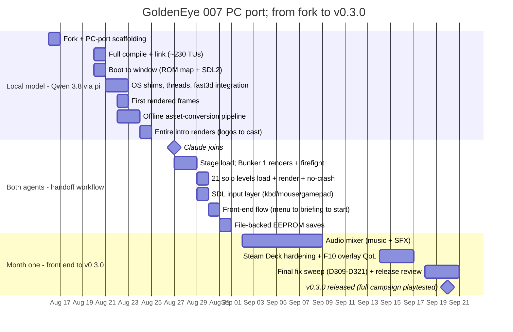
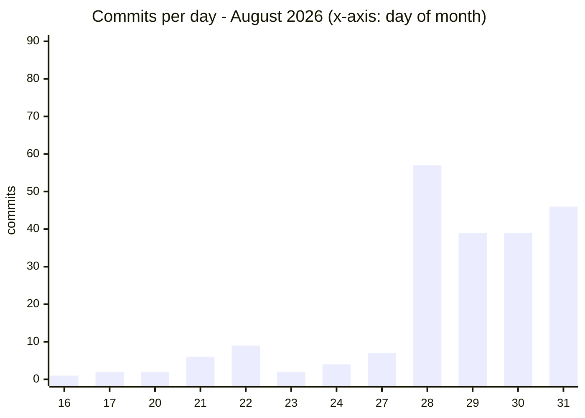
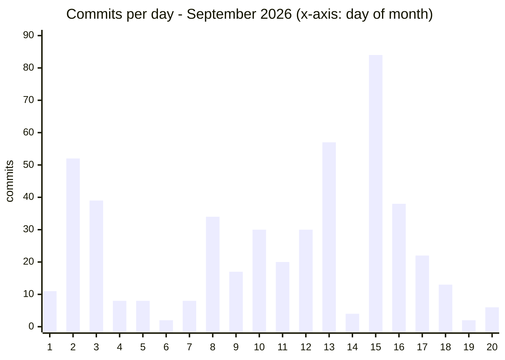
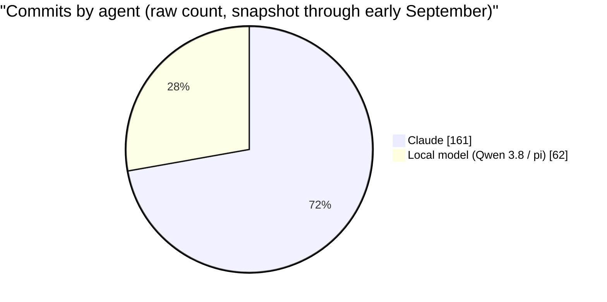
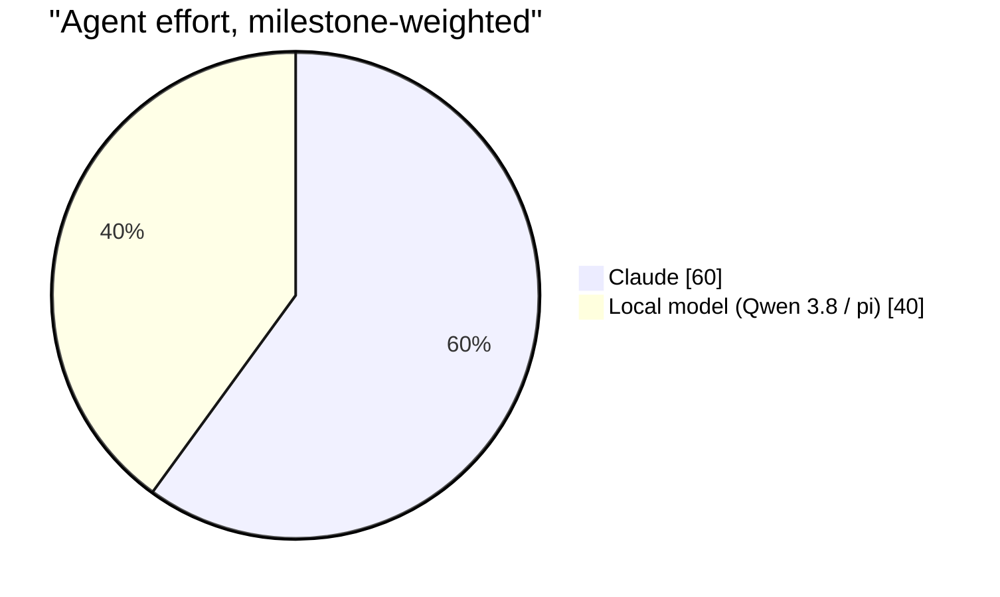
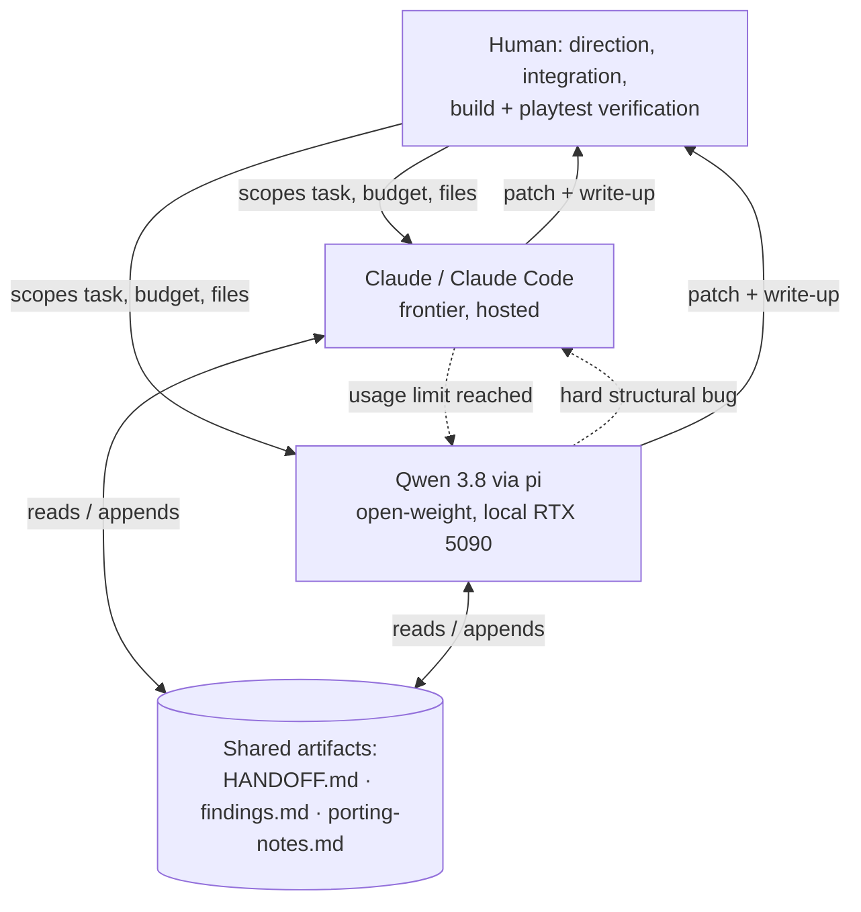

## Agentic development: two AI coding agents porting GoldenEye 007

*How this port was actually built: a local open-weight model (Qwen 3.8 on a
single RTX 5090) and a hosted frontier model (Claude / Claude Code) handing
work back and forth through shared written notes, under one person's
part-time direction. The goal, the setup, the timeline, and an honest read on
what did and didn't work.*

## Contents

- [Why this project exists](#why-this-project-exists)
- [The setup](#the-setup)
- [Timeline](#timeline)
- [By the numbers](#by-the-numbers); [Commit velocity](#commit-velocity) · [Who did what](#who-did-what)
- [The handoff workflow](#the-handoff-workflow)
- [Assessment](#assessment)

## Why this project exists

The playable port is real, but it is not the primary deliverable. The goal was
to **test how well coding agents hold up on a large, unfamiliar, low-level
codebase**; one with none of the properties that make web-app work easy for
an LLM:

- ~230 translation units of decompiled Nintendo 64 game C, compiled
  **unmodified**;
- big-endian, 32-bit, MIPS ABI assumptions throughout, run on a little-endian
  64-bit host;
- bugs that surface as a fault or a garbled frame hundreds of milliseconds
  after the actual cause, often in a different subsystem;
- a graphics coprocessor (the RSP) that has to be emulated in software before
  anything draws at all.

Concretely it set out to validate a **two-agent arrangement**: a
locally-hosted open-weight model doing the bulk of the work on a single
consumer GPU, a hosted frontier model brought in for a collaborative phase,
and, the part that turned out most interesting, the two **handing work back
and forth** through shared written artifacts, directed by one human.

## The setup

| | |
|---|---|
| Local agent | `unsloth/Qwen3.8-27B-GGUF:UD-Q4_K_XL` on a single **NVIDIA RTX 5090**, driven mainly through the **[pi](https://pi.dev/)** coding agent. Unsloth Desktop (Unsloth's local model runtime, which can drive agents such as Claude Code) was also trialed but not used significantly. |
| Hosted agent | **Claude**, via **Claude Code**, on a Claude Pro subscription; mostly **Sonnet 5**, with **Opus 5** used as an escalation tier for the hardest problems and whenever there was subscription budget to spend on it |
| Human | one person: direction, work partitioning, integration, and every build / playtest / frame-capture the agents could not run |
| Base | fork of the [GoldenEye 007 decompilation](https://github.com/n64decomp/007) (years of prior work by Larry Ficken ("kholdfuzion") and contributors) |
| Reused | the [Perfect Dark PC port](https://github.com/fgsfdsfgs/perfect_dark)'s `fast3d` software RSP; same Rare engine family |

The port is the GoldenEye-specific porting work **on top of** those two
existing bodies of work; it is not a from-scratch reimplementation of either.

In practice the models formed a **three-tier escalation**: the local model
handled well-scoped work, Sonnet 5 took what it stalled on, and Opus 5 was
reserved for the bugs that needed the most reasoning held at once; the same
"escalate when stuck" move applied at every level.

## Timeline

All dates from this repository's own commit history (August–September 2026).

- **Day 0** (16 Aug): repository forked, PC-port scaffolding added.
- **Day 4** (20 Aug): the entire ~230-TU game + libultra set compiles and
  links as a host binary.
- **Day 6** (22 Aug): first real frames render.
- **Day 8** (24 Aug): the whole intro sequence renders; logos, gun-barrel,
  cast roll.
- **Day 11** (27 Aug): second agent joins.
- **Day 13** (29 Aug): **all 21 solo missions load, render, and survive an
  unattended play window without crashing.**
- **Day 14** (30–31 Aug): front end playable end to end (menu → mission
  select → difficulty → briefing → start); file-backed saves.
- **Day 35** (20 Sep): **v0.3.0 released** — the full campaign playtested
  end to end at Agent difficulty, audio complete, bundles for Windows,
  Linux and Steam Deck.

So roughly **two weeks**, one person part-time, to take a decompilation from
"builds an N64 ROM" to "boots on desktop, renders every solo level, playable
through the front end into the early game". The rest of month one (29 Aug –
20 Sep) took it from there to a public release: the 21-level sweep to
full-campaign completion, the audio mixer, input and Steam Deck polish,
widescreen FOV scaling, and the v0.3.0 bundles — with a set of cosmetic
issues documented rather than outstanding.

## By the numbers

| | |
|---|---|
| Calendar time | 36 days (16 Aug – 20 Sep 2026), one person part-time |
| Commits on the port | ~835 |
| Root-caused bugs logged | `D1`–`D321` in [`findings.md`](https://github.com/jkdansereau/goldeneye-pc-port/blob/main/docs/dev/findings.md), 199 tracked entries in the index (some labels later merged or withdrawn) |
| Handoff sessions | 190+ (`M-2` … `M-192`, and counting) |
| Game-source files given `#ifdef PORT` ABI edits | 71 files, ~385 blocks |
| New port-layer / tooling files | ~119 |
| Port layer | ~24,450 lines C/C++ (`port/`) |
| PC asset-conversion tooling | ~7,180 lines Python (`tools_pc/`) |
| Outcome | **v0.3.0 released**: full campaign playable end to end (all 21 missions playtested at Agent difficulty) at a steady 60 fps, full audio (music + SFX), file-backed saves; Windows, Linux and Steam Deck; known cosmetic defects documented in the finding log |

### Commit velocity

Days with no commits are omitted (18–19 and 25–26 Aug). The step up from
8/28 onward is the collaborative phase in full swing, including the parallel
multi-agent "bursts"; the 9/15 spike is the Steam Deck playtest-feedback
batch landing at once.

### Who did what

(Phase A, the first 26 commits, to 24 Aug, was entirely the local model,
solo; from 27 Aug on the two agents worked in parallel. The raw tally was
not re-run for the final third of the project; treat the milestone-weighted
estimate below as the better number.)

| Milestone / workstream | Primary agent | Weight |
|---|---|---|
| PC build system, region macros, full compile + link of ~230 units | local model | large |
| Boot chain: ROM map, OS-shim layer (`libultra.c`), host threads, dual-mapped DRAM | local model | large |
| Software-RSP integration + replacement scheduler (`gesched.c`) | local model | medium |
| Offline asset-conversion architecture + first converters (`tools_pc/`) | local model | large |
| Intro rendering (logos → gun-barrel → cast) | local model | medium |
| Stage load unblocked (`D69`–`D87`) | Claude | medium |
| 21-level crash sweep; ~12 crash classes root-caused (`D88`–`D169`) | Claude | large |
| SDL input layer (keyboard / mouse / gamepad, mouse-look) | Claude | medium |
| Front-end flow (menu → briefing → start), EEPROM saves | Claude | medium |
| Parallel struct-layout / converter static audits | local model | medium |
| Continuing tasks after Claude hit a usage limit | local model | small |
| The hardest structural bugs (matrix handedness, format specs) | Claude | n/a |
| Every build, playtest, frame capture, integration, and direction | human | n/a |

**Estimated effort split.** The raw commit count above (~28% local / ~72%
Claude) undercounts the local model: Phase A landed the build system and boot
chain in relatively few, large commits, and the local model kept contributing
~15–20% of Phase B in parallel. Weighting by milestone difficulty rather than
raw commits; the foundation is a heavier third of the project than its commit
share suggests; the developer's estimate is roughly:

The local model's ~40% is front-loaded and foundational (the build, the boot
chain, the RSP wiring, the converter architecture) plus continuous parallel
support; Claude's ~60% is the higher-volume Phase-B debugging, the two big
discrete features, and the hardest structural bugs. A 27B open-weight model on
one consumer GPU carrying the entire foundation of a project like this is the
result worth taking away.

## The handoff workflow

This is the part worth paying attention to.

Both agents worked against the **same three written artifacts**, which is what
let them substitute for each other:

1. **`HANDOFF.md`**; the current state, the immediate next task, and the
   environment gotchas. Originally a session-to-session note for one agent, it
   became the **interface between the two agents**: when Claude reached a
   usage limit mid-problem, the local model picked the task up from the
   HANDOFF state and continued; when the local model hit a bug that needed
   deeper structural reasoning, it wrote up where it was and Claude took over.
2. **`findings.md`**; the chronological finding log. 321 numbered `D`
   entries by v0.3.0 (199 tracked in the index; some labels merged or
   withdrawn), each a root cause with `file:line` evidence and the fix. New
   agents (either model) are pointed at the relevant entries before they
   start.
3. **`porting-notes.md`**; the append-only "recurring bug classes" file. The
   single highest-leverage artifact: it stopped both models from
   re-deriving the same class of N64→PC bug over and over.

Around these, the working rules (full detail in
[`../dev-process.md`](../dev-process.md)):

- **file-partitioned tasks**; each agent's task scoped to a disjoint set of
  files so patches never collided;
- **visible budgets**; every investigation task carried an explicit
  "N build→run cycles" limit and a defined fallback (revert probes, write up
  with a confidence rating);
- **the human owns verification**; building, running the game, capturing a
  frame, and judging it against N64 reference footage was never delegated.

## Assessment

Honest notes, for anyone weighing whether this transfers.

**Worked well**

- The **local model carried the groundwork phase**; build system, boot
  chain, OS shims, and the offline-converter architecture. None of it was
  rewritten later. A 27B open model on one consumer GPU was genuinely productive
  on this.
- **The written-artifact discipline made agent output compound.** An agent
  starting cold late in the project was more effective than one early on,
  because the accumulated notes were good. This is also what made the two
  models interchangeable on a given task.
- **Handoff on limit** turned Claude's usage cap from a hard stop into a
  slowdown; the local model kept the problem moving.
- Bounded behavioural bugs (a truncated pointer, a byte-swap off by one) are a
  good fit for an agent given a tight loop and a reference to diff against.

**Worked poorly / needed the human**

- **Anything requiring the running game.** Build, playtest, capture a frame,
  decide whether it looks right; that loop was the human's job throughout,
  and it was the bottleneck.
- **Non-deterministic bugs.** Frame-timing stalls and concurrent-build
  flakiness repeatedly fooled agents into "fixing" regressions that were not
  real. A number of findings are corrections of earlier findings.
- **Long structural bugs** (matrix handedness, a whole serialized-format
  spec) often ended in a "here is what I know, confidence medium" writeup
  rather than a fix, even with the budget raised.
- **The capability gap is a gradient, not a wall.** The local model was strong
  on well-scoped work and weaker when a bug needed several interacting facts
  held at once; those went to Sonnet 5, and the few that stalled Sonnet went
  to Opus 5. Each tier earned its place on the problems the tier below it
  couldn't close.

**Still outstanding** (the v0.3.0 known-issues list): cosmetic rendering
defects (particle colours, Surface 1 billboard trees, front-end logos, water
seam), stretched-not-native widescreen, PAL/JP support, a controller
rebinding UI, and macOS/ARM builds. See the README's Status section and
[`GRAPHICS-BACKLOG.md`](https://github.com/jkdansereau/goldeneye-pc-port/blob/main/docs/dev/GRAPHICS-BACKLOG.md).
